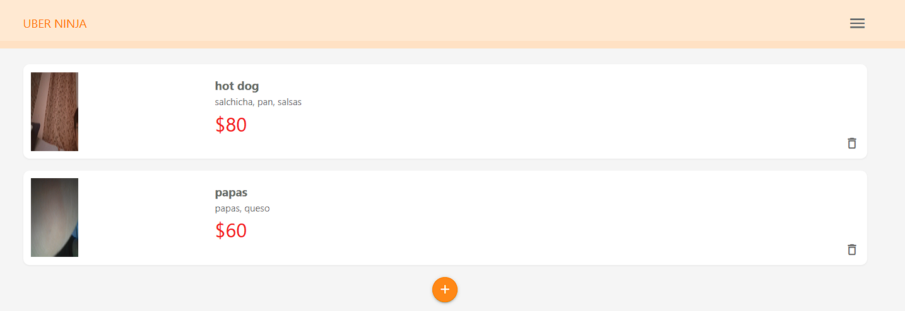
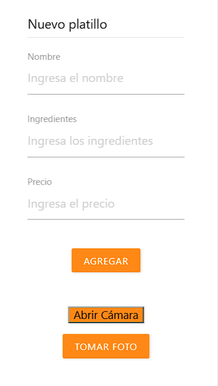
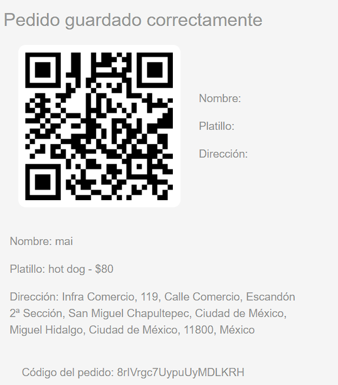
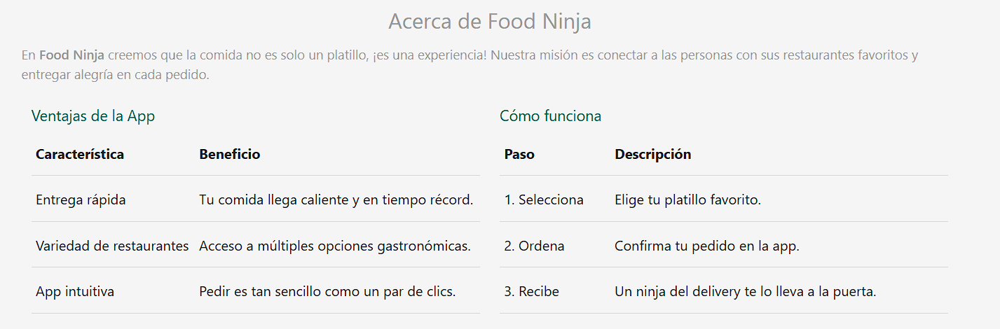
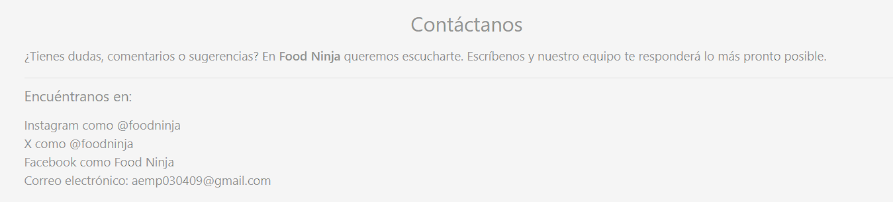
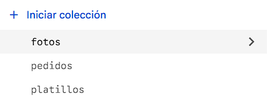

# Food Ninja

## Nombre de la aplicación
**Food Ninja** 

## Descripción breve
Plataforma tipo delivery que permite agregar, visualizar y administrar platillos con fotos tomadas directamente desde la cámara trasera del dispositivo.  
Los usuarios pueden gestionar sus pedidos de manera rápida y sencilla.

## Nombre del proyecto
**UberEatsCUDEC**

## Tipo de aplicación
**PWA**

## Descripción en una o dos líneas
Aplicación progresiva que simula un sistema de pedidos de comida, con integración de cámara y almacenamiento en Firebase Firestore.

## Materia / Carrera / Alumno
- Materia: **Programación avanza III**  
- Carrera: **Ingeniería en Sistemas Computacionales**  
- Alumno: **Adrian Emiliano Medel Padilla**

## 2. Descripción del proyecto
**Food Ninja (UberEatsCUDEC)** es una aplicación progresiva (PWA) que simula un sistema de pedidos de comida.  
El problema que resuelve es la **gestión rápida y sencilla de platillos** en un entorno digital, permitiendo a los usuarios agregar, visualizar y administrar pedidos con fotos tomadas directamente desde la cámara trasera del dispositivo.  
Sus usuarios principales son **estudiantes y desarrolladores** que buscan aprender sobre PWA, Firebase y manejo de cámara en aplicaciones web.  
El propósito es **facilitar el aprendizaje práctico** de tecnologías modernas aplicadas a un caso real de delivery.

## 3. Objetivos
### Objetivo general
Desarrollar una aplicación progresiva (PWA) que permita la gestión de platillos con integración de cámara y almacenamiento en una base de datos.

### Objetivos específicos
- Implementar un CRUD de platillos (crear, mostrar, actualizar, borrar).  
- Integrar la cámara trasera del dispositivo para capturar fotos de los platillos.  
- Almacenar la información en **Firebase Firestore**.  
- Diseñar una interfaz responsiva con **Materialize CSS**.  
- Configurar la aplicación como **PWA** para instalación en dispositivos móviles.

## 4. Características principales
- Interfaz responsiva con menús laterales.  
- CRUD de platillos con foto.  
- Captura de imágenes desde la cámara trasera.  
- Almacenamiento en Firebase Firestore.  
- Secciones: Inicio, Acerca de, Pedidos, Contacto.  
- Configuración como PWA (manifest.json, service worker).  

## 5. Tecnologías utilizadas
- **HTML5**  
- **CSS3** (Materialize v1.0.0)  
- **JavaScript ES6**  
- **Firebase Firestore** (última versión SDK web)  
- **PWA** (Progressive Web App con manifest.json y service worker)  

## 6. Estructura del proyecto
UberEatsCUDEC/
│── index.html        # Página principal
│── pages/
│   ├── about.html    # Acerca de la app
│   ├── contact.html  # Contacto
│   └── pedidos.html  # Pedidos
│── css/
│   ├── materialize.min.css
│   └── styles.css    # Estilos personalizados
│── js/
│   ├── materialize.min.js
│   ├── index.js      # Lógica principal 
│   └── ui.js         # Inicialización de menús
│── img/              # Imágenes y capturas de pantalla
│── manifest.json     # Configuración PWA
│── sw.js             # Service Worker

## 7. Capturas de pantalla
### Pantalla principal (index.html)

### Platillo

### Realizar pedido

### Acerca De

### Contacto

## 8. Base de datos

### Motor utilizado
- **Firebase Firestore** (NoSQL, base de datos en la nube).

### Colecciones

- **Platillo:** contiene los campos: foto, ingredientes, costo y nombre.
- **Pedidos:** contiene los campos: dirección, fecha, nombre y idplatillo
- **Fotos:** contiene las fotos de los platillos en base64

### Resumen
La aplicación utiliza **Firestore** como motor de base de datos para almacenar la información de los platillos en formato de documentos dentro de la colección `platillos`.  
Cada documento es flexible y puede incluir la foto en formato **Base64**, lo que permite guardar imágenes directamente sin necesidad de un servidor adicional.

## 9. Licencia
**Licencia** 
 Este proyecto fue desarrollado con fines académicos como parte de la carrera Ingenieria en Sistemas Computacionales, para la materia Programación Avanzada III, del 09ISC182 en Universidad CUDEC. 
